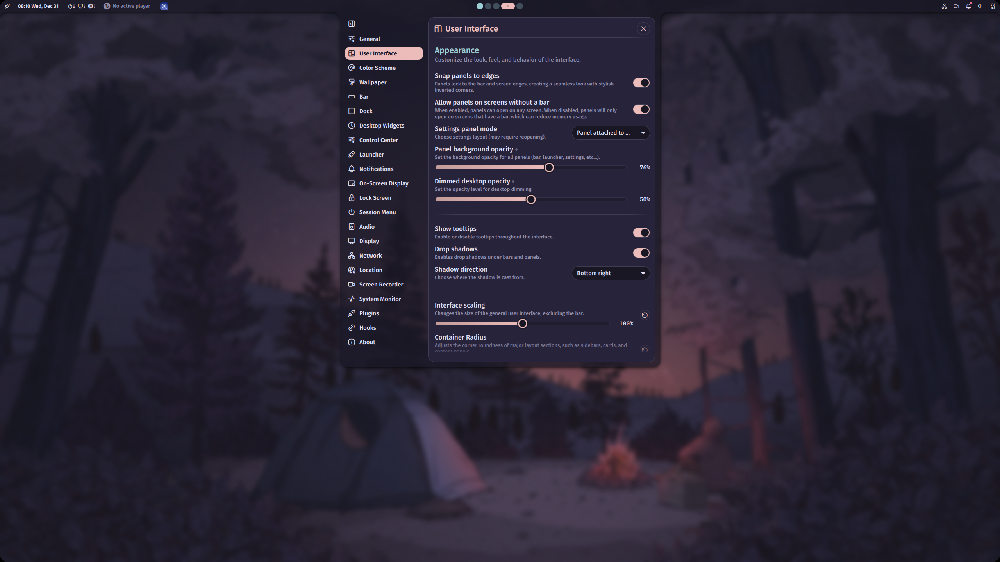

Add the following settings to your Hyprland configuration file (usually located at `~/.config/hypr/hyprland.conf`).

These settings are for general window appearance and functionality.

```ini
general {
  gaps_in = 5
  gaps_out = 10
}

decoration {
  rounding = 20
  rounding_power = 2

  shadow {
    enabled = true
    range = 4
    render_power = 3
    color = rgba(1a1a1aee)
  }

  blur {
    enabled = true
    size = 3
    passes = 2
    vibrancy = 0.1696
  }
}
```

## Blur

Next, you can enable blur for the Noctalia bar and panels background.


```ini
layerrule {
	name = noctalia
	match:namespace = noctalia-background-.*$
	ignore_alpha = 0.5
	blur = true
	blur_popups = true
}
```

:::tip[Fine-tuning the blur effect]
Adjust the `ignore_alpha` value in Hyprland alongside these Noctalia transparency settings to achieve your desired look:

- **Panel background opacity** — Controls panel transparency
- **Bar background opacity** — Controls bar transparency (optional)
- **Dimmed desktop opacity** — Controls the full-screen blur when a panel is open
:::


