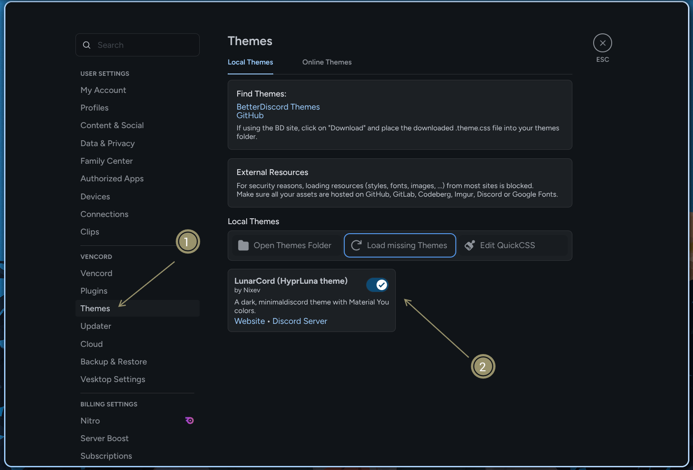

Noctalia supports multiple Discord client alternatives that can be themed.

## Supported Clients

- **Vesktop** - Modern Discord client
- **WebCord** - Privacy-focused Discord client
- **ArmCord** - Lightweight Discord client
- **Equibop** - Discord client
- **Lightcord** - Discord client
- **Dorion** - Discord client
- **Vencord** - Discord client

## Setup

1. **Install your preferred Discord client:**
   ```bash
   # Example for Vesktop (Arch Linux)
   paru -S vesktop
   ```

2. **Enable Discord theming in Noctalia:**
   - Open **Settings → Color Scheme → Templates → Programs**
   - Toggle on **Discord**

3. **Enable theme in Discord:**
   - Open your Discord client
   - Go to **Settings → Themes**
   - Toggle one of the two available Noctalia themes



## Troubleshooting

- **Theme not appearing:** Make sure you've enabled the theme in Discord settings
- **Colors not updating:** Restart your Discord client after changing color schemes
- **Client not supported:** Check that your Discord client is one of the supported alternatives
- **Theme looks broken:** Ensure you're using a supported Discord client and have the latest version

## Additional Notes

The theme will automatically update when you change color schemes in Noctalia.

