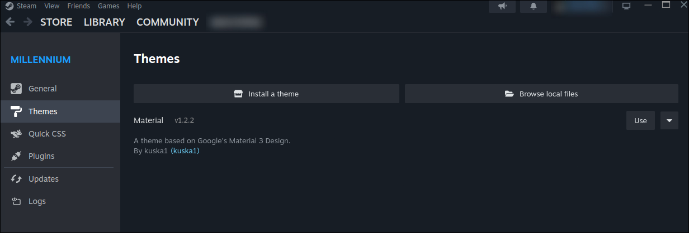
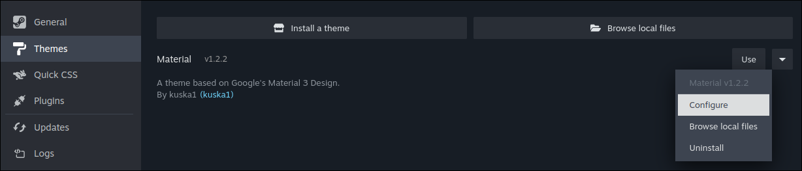
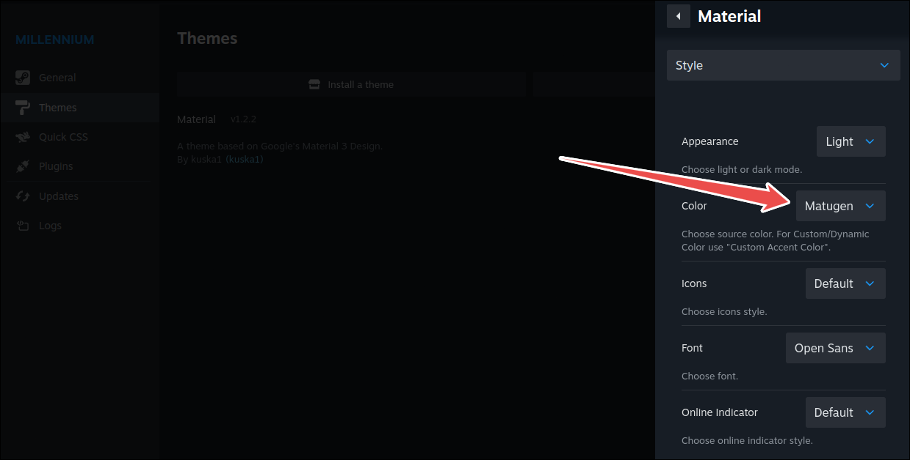

The official Steam client can be themed using the Noctalia color scheme through the built-in theme system.\
This requires the open-source modding framework [Millennium](https://github.com/SteamClientHomebrew/Millennium) and takes advantage of the [Material Theme](https://github.com/kuska1/Material-Theme) to provide dynamic color integration.

## Setup

1. **Enable Steam theming in Noctalia:**
   - Open **Settings → Color Scheme → Templates → Misc**
   - Toggle on **Steam**

2. **Install Millennium**: you can find instructions for your distribution on [the installation page](https://docs.steambrew.app/users/getting-started/installation).

3. **Install Material-Theme**: copy the Theme ID from [the theme's page on steambrew.app](https://steambrew.app/theme?id=ipYjqODds05KMcvh7QJn), and install it in the Millenium Theme settings.\
After that, you should see the theme installed but not enabled yet:

4. Enable the theme by clicking on the "Use" button.

5. Click on the drop-down on the right to configure the theme:

6. In the "Color" drop-down menu, make sure to select "Matugen".

7. Regenerate a color scheme in Noctalia (for example, toggling dark-light mode, or changing the wallpaper), and restart Steam.

## Troubleshooting

- **Theme not appearing:** Make sure you've enabled the theme in Millenium settings.
- **Colors not updating:** Restart the Steam client fully (`Steam` menu > `Exit`) after installing the theme and toggling Matugen option. Also make sure Millennium is installed and running correctly.
- **Theme looks broken:** Ensure you're using the official Steam client and have the latest version of Millennium and Material-Theme.

## Additional Notes

The theme will automatically update when you change color schemes in Noctalia.
