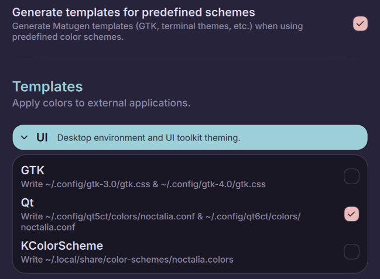
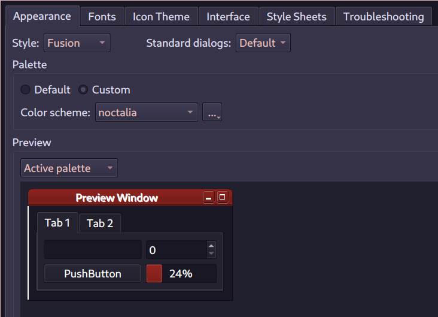
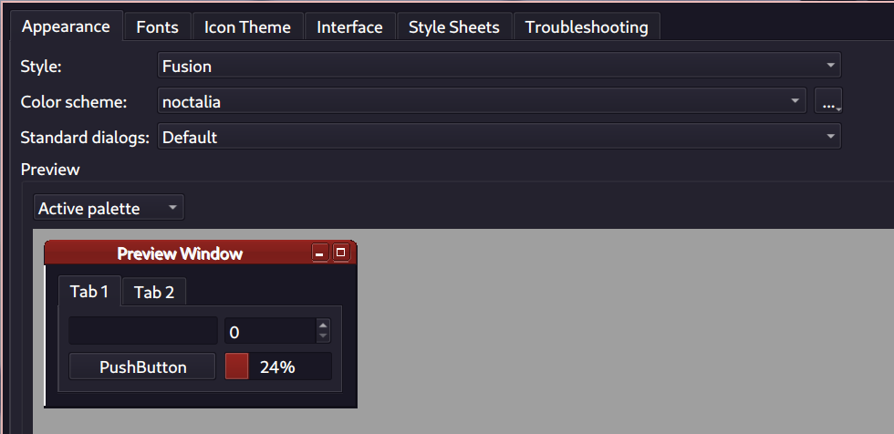
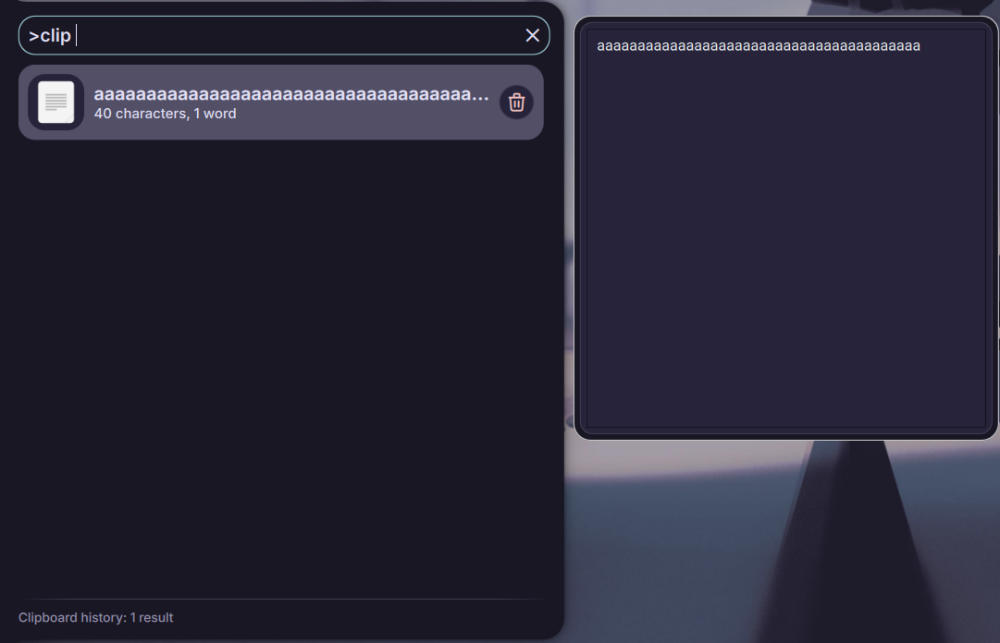

import FaqItem from '../../../../components/FaqItem.astro';

Find answers to common questions about Noctalia installation, configuration, and usage.

## Installation & Compatibility

<FaqItem question="How can I run Noctalia on unsupported distributions?">

Noctalia is officially packaged for Arch, NixOS, Gentoo, Fedora, Debian (including Ubuntu and PikaOS), openSUSE, and Void Linux. See the [Installation guide](/v4/getting-started/installation/) for details.

For other distributions, you can install manually but will need to build **[noctalia-qs](https://github.com/noctalia-dev/noctalia-qs)** (our custom fork of Quickshell) from source - the upstream `quickshell` package from your distro's repositories will not work. See the [manual installation instructions](/v4/getting-started/installation/#manual-install) for steps.

</FaqItem>

<FaqItem question="Can I use noctalia-qs with other Quickshell-based projects?">

Yes! **noctalia-qs** is a drop-in replacement for upstream Quickshell - it provides the same `qs` command and supports the same configs, so any Quickshell-based project will work with noctalia-qs without changes.

However, **noctalia-qs and upstream Quickshell cannot be installed at the same time** since they provide the same packages. If you already have noctalia-qs installed for Noctalia, you can use it to run any other Quickshell config - no need to install upstream Quickshell separately.

</FaqItem>

<FaqItem question="What window managers does Noctalia support?">

Noctalia is designed for and tested with Niri, Hyprland, Sway, Scroll, Labwc and MangoWC. While it may work with other compositors, we currently only support workspace indicators for Niri and Hyprland.

</FaqItem>

## Configuration

<FaqItem question="Why are some of my app icons missing?">

The issue is most likely that your environment variables and icons theme are not set properly.

Add these variables via your compositor or to `/etc/environment` and reboot.
On NixOS, use `environment.variables` or `home.sessionVariables`.

Then use one of the three following options:

:::note[Option 1: if you prefer GTK]
Set `QT_QPA_PLATFORMTHEME=gtk3`
Then use an utility like `nwg-look` (available in most distros) to select and apply your favorite icons theme.
:::

:::note[Option 2: If you prefer Qt]
Set `QT_QPA_PLATFORMTHEME=qt6ct`
Then run `qt6ct` to select and apply your favorite icons theme.
:::

:::note[Option 3: Force an icon theme for Quickshell]
Set `QS_ICON_THEME="youricontheme"`
:::

:::note[For Niri users]
Ensure that you set environment variables properly.

<details>
<summary>If you prefer to set these in Niri's config</summary>
Ensure that you also launch Noctalia via Niri:
```ini
spawn-at-startup "qs" "-c" "noctalia-shell"
```
This is because Niri only overrides environment variables for processes it spawns.
</details>

<details>
<summary>If you prefer systemd</summary>
Systemd startup setup is now legacy-only and documented here: [Systemd Startup](/v4/deprecated/systemd-startup/).
</details>
:::

</FaqItem>

<FaqItem question="How can I make the UI bigger?">

**First things first**, you should increase your **compositor scaling** per monitor. This is the **best solution** and should give you a nice scaled up UI on HiDPI monitors.

</FaqItem>

<FaqItem question="How can I get Noctalia to display in my language?">

Noctalia automatically uses your operating system's language settings. If the application appears in English, it's likely because a translation for your language isn't available yet, causing it to use English as a fallback.

How to Change the Language
Changing Noctalia's language involves adjusting your computer's system-wide language settings, not a setting within the app itself.

1. Check if Your Language is Supported
First, you can see which translations are included with Noctalia. Look inside the installation folder for a directory named /Assets/Translations. You'll find files ending in .json, named with language codes (e.g., es.json for Spanish, fr.json for French, de.json for German). If you don't see a file for your language, you'll need to use one that is available.

2. Set Your System Language
You'll need to change the primary language for your entire operating system.

The method varies by distribution. For command-line users, the localectl command is common. For example, to set your language to Spanish (Spain), you would run:

```bash
sudo localectl set-locale LANG=es_ES.UTF-8
```

After changing your system's language, restart Noctalia for the changes to take effect.

If Noctalia doesn't support your language yet, consider contributing a translation! Check the project's repository on GitHub for instructions on how to contribute.
</FaqItem>

## Window Manager Integration

<FaqItem question="How can I make empty or unused workspaces always show up in Hyprland?">

To make workspaces always visible, even when empty, you need to set them as persistent in your hyprland.conf file. You can find the specific syntax and examples in the official documentation for [Workspace Rules](https://wiki.hypr.land/Configuring/Workspace-Rules/#rules).
```
workspace = 1, monitor:DP-1, persistent:true
workspace = 2, monitor:DP-1, persistent:true
workspace = 3, monitor:DP-1, persistent:true
workspace = 4, monitor:DP-1, persistent:true
workspace = 5, monitor:DP-1, persistent:true
```
</FaqItem>

## Troubleshooting

<FaqItem question="Why aren't my keybinds working?">

Common causes:

1. **Wrong command syntax**: Make sure you're using the correct IPC command format
2. **Window manager configuration**: Verify your keybind syntax matches your WM (Hyprland, Niri etc)
3. **Noctalia not running**: Keybinds only work when Noctalia is running
4. **Necessary environment variables not visible to Noctalia at start-up**: This affects Niri Systemd/UWSM/people who do not set the contained environment variables:
   - Run:
   ```sh
   tr '\0' '\n' < /proc/$(pidof qs)/environ
   ```
   to confirm if this is indeed your issue; you should see `WAYLAND_DISPLAY` with a value of `wayland-1`, `XDG_SESSION_TYPE` `wayland` and `QT_QPA_PLATFORM` `wayland` (or `wayland;xcb`).
   - If you do not see any of these three you must make them available to Noctalia by adding them to a place where they can be seen in time:
      - `/etc/environment` for Niri Systemd/UWSM
      - in-config of your compositor for Niri without Systemd/UWSM-less method outlined in [Systemd Startup](/v4/deprecated/systemd-startup/)
   - After setting the values re-log back in/reboot.
   - Confirm it worked by checking `qs list --all`, it should list under Display connection `wayland,wayland-1` (also see the note right below if it lists `unk` but IPC calls work).
   :::note[unk]
   A value of `wayland;xcb` for `QT_QPA_PLATFORM` is also valid and will let IPC calls work, the quickshell parser is simply bad, this is a fake 'issue'.
   :::
   :::note[Bypass]
   If you don't want to do any of this, while we don't recommend it, you can keep using IPC calls by passing `--any-display` to them.
   :::

</FaqItem>

<FaqItem question="Why is my battery not showing?">

<strong>UPower is required for battery status to be displayed in Noctalia.</strong> If your battery indicator is missing, make sure <code>upower</code> is installed.

**How to fix:**

1. Install UPower using your package manager. For example:
   - On Arch: <code>sudo pacman -S upower</code>
   - On Debian/Ubuntu: <code>sudo apt install upower</code>
   - On NixOS: add <code>upower</code> to your system packages
2. Log out and back in, or reboot, after installing. On most systems, UPower will start automatically.
3. Restart Noctalia to check if the battery now appears.

If you still do not see a battery indicator after installing and starting UPower, please check your system logs or ask for help in the community.

</FaqItem>

<FaqItem question="Why won't some applications appear in the launcher?">

The launcher looks for `.desktop` files in standard locations. If an application doesn't appear:

1. **Refresh the launcher cache** by restarting Noctalia.
2. **Verify that a `.desktop` file exists** in one of these directories:
   - `/usr/share/applications/`
   - `~/.local/share/applications/`
   - `$HOME/.nix-profile/share/applications/` (apps installed with Nix/Home Manager)
   - `/etc/profiles/per-user/$USER/share/applications/` (system/user-wide Nix profiles)
3. **Create a `.desktop` file manually** for custom applications if none is provided.

</FaqItem>

<FaqItem question="Why does Noctalia crash on startup?">

1. **Check the error output** by running Noctalia from the terminal
2. **Update dependencies** - outdated Quickshell versions can cause issues
3. **Check system logs** for additional error information

</FaqItem>

<FaqItem question="Why do I have a weird gap?">

This usually means `noctalia-shell` is running more than once (for example, launched by both your compositor autostart and the systemd service). Multiple instances fight over layout space and leave blank gaps.

Make sure only a single instance is started:

1. Stop extra copies (`kill -9 qs` or reboot)
2. Pick one startup method (manual, compositor autostart, systemd, or Home Manager) and disable the others

</FaqItem>

<FaqItem question="Why can't I unlock my lock screen?">

Noctalia now uses the standard <code>/etc/pam.d/login</code> for authentication. If you are unable to unlock your lock screen, make sure this file exists and is properly configured on your system.

On some distributions (such as openSUSE), <code>/etc/pam.d/login</code> may not be present by default. You may need to create it manually or copy it from another distribution. Consult your distribution's documentation for details.

If you have previously used a custom PAM configuration for fingerprint authentication or any other form of authentication, you can now remove it. Noctalia will use the system's default authentication methods as defined in <code>/etc/pam.d/login</code>.

</FaqItem>

<FaqItem question="How to enable Yubikey for Noctalia Lockscreen?">

Noctalia lock screen pulls it's authentication info from <code>/etc/pam.d/system-login</code> this is where we will need to add our PAM info for our Yubikey
Please Note: This instruction assumes your Yubikey is already configured for this consult your distros documentation.

we're going to need to edit <code>/etc/pam.d/system-login</code>, so use whichever text editor you like. <code> sudo nvim /etc/pam.d/system-login </code>  find the last instance of a line that starts with "auth" and make a new line after that

in the new line, type (or copy and paste) in the following: auth required pam_u2f.so

write and quit the file

If you want to require ONLY the yubikey to unlock your screen:
1. Open the file back up with your text editor
2. Find the line that contains: auth include system-auth

comment out the line so that it looks like: #auth include system-auth

Example once completed
<code>
auth       required   pam_shells.so
auth       requisite  pam_nologin.so
#auth       include    system-auth
auth       required   pam_u2f.so
</code>

write and quit the file

</FaqItem>

<FaqItem question="Why are my tray icons missing after (re)starting Noctalia?">

This typically happens when KDE is installed alongside your window manager. KDE's tray daemon (`kded6`) can interfere with Noctalia's system tray, though it usually doesn't autostart at cold boot.

**Common cause:** Opening Dolphin (KDE's file manager) with sudo or elevated privileges will respawn `kded6`, which can cause tray icons to disappear.

**Solution: Manually stop the process**

Run this command, then restart Noctalia:
```bash
pkill kded6
```

You can also add this to your compositor's autostart configuration if needed:

:::note[Niri]
```ini
spawn-sh-at-startup "pkill kded6"
```
:::

:::note[Hyprland]
```ini
exec-once = pkill kded6
```
:::

</FaqItem>

<FaqItem question="Audio Sample Rate Not Switching">

If you have followed instructions for How to allow Sample Rate Switching in your Distro of choice and notice it does not work

This is likely due to CAVA(Dependency for the Visualizers) being installed as it has a tendencey to grab the first sample rate you it see and stay there.

Options are:
1. Not use CAVA and by relation the visualizers.
2. Unload and Reload Elements of the UI and setting a keybind for such when this needs to adjust.

</FaqItem>


## Appearance & UI

<FaqItem question="Why does the shell look different than expected?">

1. **Check your theme settings** in the settings panel
2. **Verify your display settings** - scaling and resolution can affect appearance
3. **Update to the latest version** - UI improvements are frequently released

</FaqItem>

<FaqItem question="Why does my clipboard history preview look weird?">

**How to fix:**

1. Open Noctalia's Settings -> Color Scheme -> Generate templates for predefined schemes -> UI -> Check the Qt checkbox (skip this part if you have your own Qt theme).



2. Install **qt5ct** and **qt6ct** on your system, then set both Color schemes to **noctalia**.





3. Check **>clip** again to see if the theme is applied (if not try to restart noctalia or logout/login again)



</FaqItem>


## Still Need Help?

If your question isn't answered here:

- **Search our documentation** for more detailed guides
- **Join our Discord community** for real-time help and discussion
- **Check GitHub issues** for similar problems and solutions
- **Create a new issue** if you've found a bug or need specific help

Remember to include relevant system information and error messages when asking for help!
